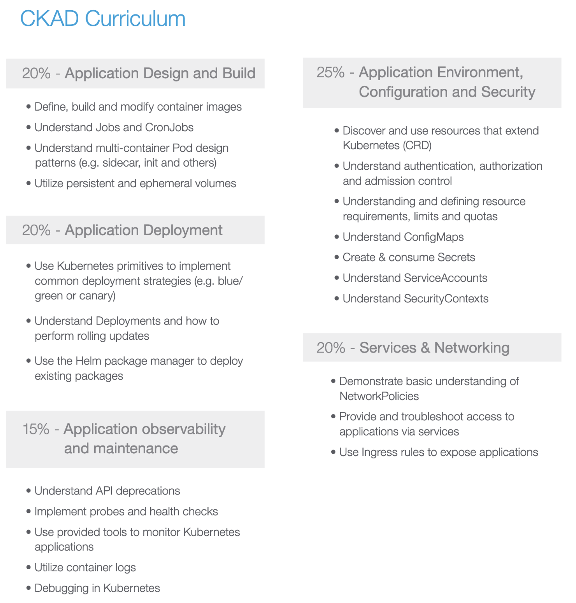

# Learn Kubernetes

This is a collection of resources to learn kubernetes. It is a work in progress.

## What is Kubernetes?

> Kubernetes is an open-source system for automating deployment, scaling, and management of containerized applications. 
> It groups containers that make up an application into logical units for easy management and discovery.

## About this Course

This course is designed to help you learn Kubernetes to pass the Certified Kubernetes Application Developer (CKAD) exam.

